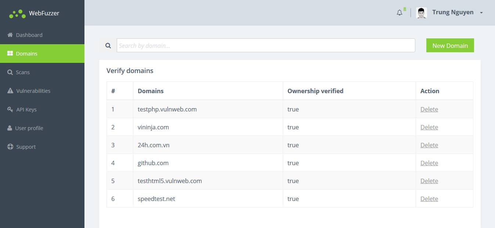
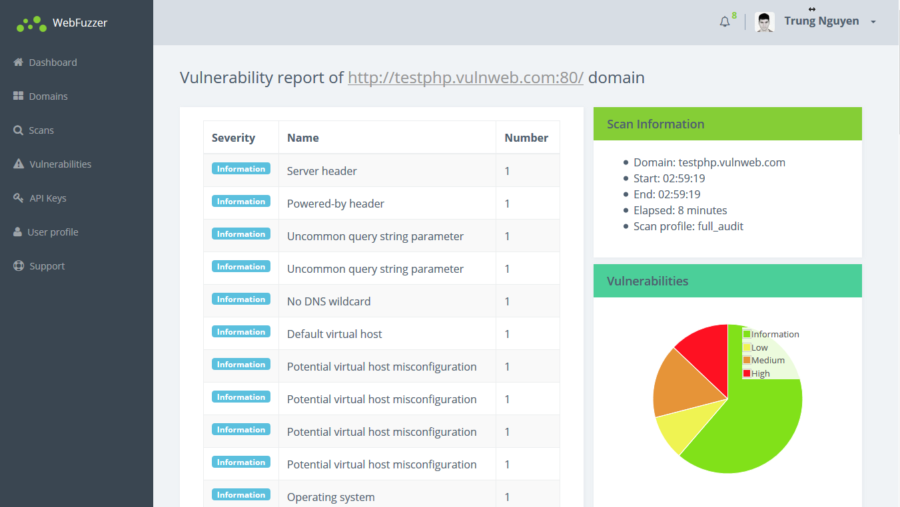
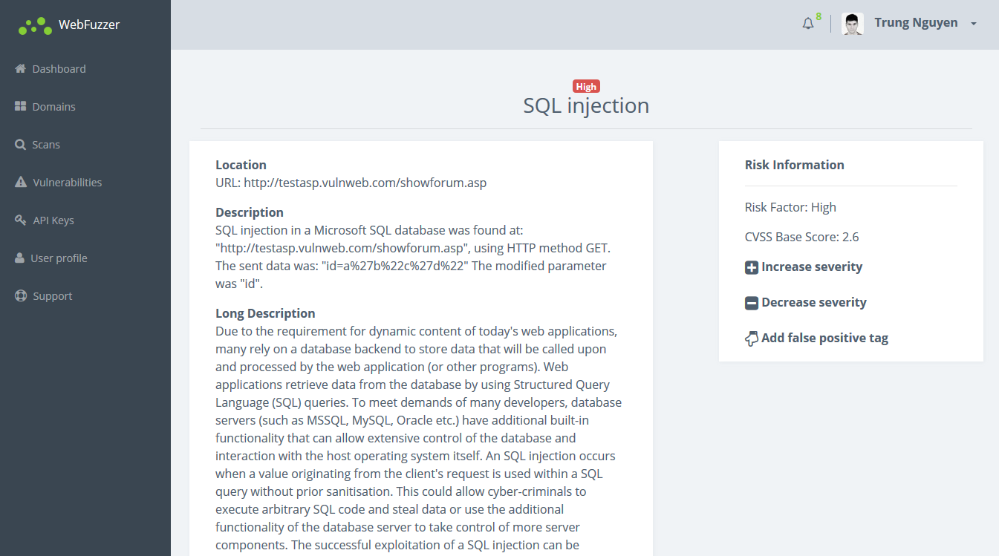

# Cystack team
We are a team of young developers who are energetic and enthusiastic about security. Our team members include:
- Nguyen Huu Trung (leader)
- Le Van Giap
- Phan Xuan Tien
- Do Quang Thanh
- Do Minh Tuan

# About WebFuzzer
## What is WebFuzzer?
**WebFuzzer** is a SAAS (Software As A Service) **Web Application Penetration** product in which it has:
- Input: Web application domain
- Output: Overall graph report, list of vulnerabilities and their details

The spectacular superority of **WebFuzzer** is that it provides patching strategies after finding vulnerabilities in Web application by 2 selections:
- Automatically generating rules for **modsecurity** and **iptables** for customers to update on their system
- Guiding customers to use Web Application Firewall and then apply patches to revamp their Web application system

## WebFuzzer advantages
- **Easy to use:**
    - Friendly Web application user interface
    - No need to install any additional modules or plugins except a browser
    - No need to care about *client computer* specs
- **Opensource**, build on the top of [w3afi](https://github.com/andresriancho/w3af), with a highly extensible ability
- Having the ability to detect more than **200 types of vulnerabilities** (and this number will be increased in the future)
- **Distributed handling**, be able to simultaneously handle a considerable amount of Web application
- **REST API**: Allow security specialists build their Scanner base on the **WebFuzzer** architecture
- **Multiplatform**: Currently **WebFuzzer** works as a *Web service*. *CLI*, *Mobile*, *PC* and other platforms will be supported in the near future base on the built APIs

## System architecture

## Deploy guide (for service providers, not endpoint users)
1. Install [w3af](https://github.com/andresriancho/w3af) on dedicated servers and start the *w3af_api* process. Multiple *w3af_api* processes can be opened on every server based on their system specification
2. Install RabbitMQ for Message Queuing
3. Config Server and Dispatcher, additionally provide w3af servers list by their IP and Port
4. Establish environment for *Flask* server by *nginx*, *gunicorn*
5. Start the server

## User Interface

